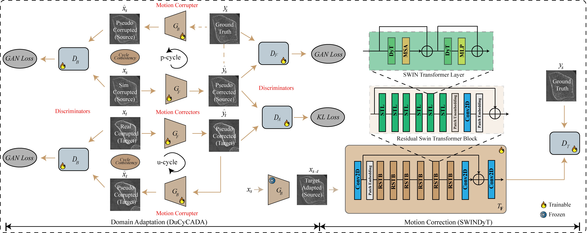
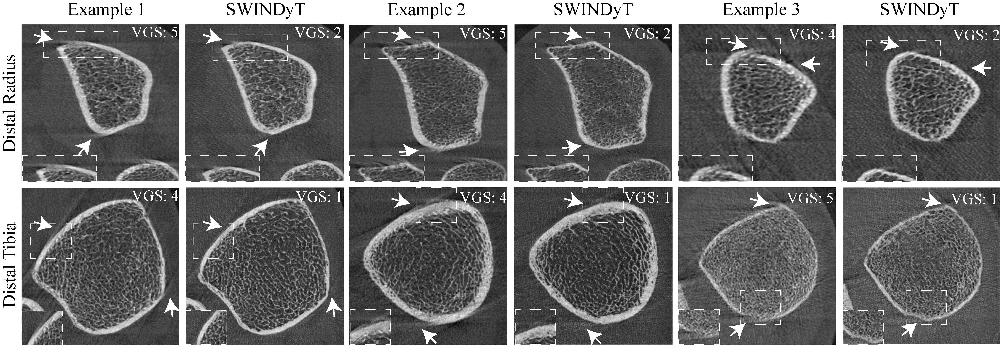

# DuCyCADA + SWINDyT: Domain-Adaptive Motion Correction for HR-pQCT

A two-stage deep learning pipeline for correcting motion artifacts in
high-resolution peripheral quantitative CT (HR-pQCT) images. The pipeline
bridges the gap between simulated and real-world motion corruption through
unsupervised domain adaptation, then trains a supervised correction network
on the adapted data.

---

## Pipeline overview

```
Stage 0 ── Pre-training          DuCyCADA trains on (simulated source ↔ real target)
                                       │
                                       ▼
Stage 1 ── Domain adaptation     G_forward_da maps source images → adapted domain (store the G_backward weights from DuCyCADA)
                                       │
                                       ▼
Stage 2 ── Supervised training   SWINDyT trains on adapted (X_adapted, Y_s) pairs
                                       │
                                       ▼
Stage 3 ── Inference             SWINDyT corrects unseen motion-corrupted images
```

At inference time **only the trained SWINDyT model is needed**.

---

## Architecture overview




---
## Qualitative results



---

## Repository structure

```
.
├── DuCyCADA/                       # Unsupervised domain adaptation
│   ├── ducycada/
│   │   ├── __init__.py
│   │   ├── config.py               # All hyper-parameters and paths
│   │   ├── datasets.py             # ImageDataset, ImageDataset_DA
│   │   └── metrics.py              # VIF, histogram matching, difference maps
│   ├── scripts/
│   │   └── preload_data.py         # Pre-load DA training data to GPU
│   ├── train.py                    # Train DuCyCADA
│   ├── evaluate.py                 # Evaluate DuCyCADA on test split
│   ├── requirements.txt
│   └── README.md
│
├── SWINDyT/                        # Supervised motion-correction network
│   ├── datasets.py                 # Dataset classes and dataloader factory
│   ├── models.py                   # SwinIR-based network definition
│   ├── utils.py                    # Image processing and metric utilities
│   ├── preload_data.py             # Run G_forward_da and cache adapted data
│   ├── train.py                    # Train SWINDyT on adapted dataset
│   ├── test.py                     # Inference and PNG output
│   ├── evaluate.py                 # PSNR / SSIM / VIF / BRISQUE / LPIPS
│   ├── plot_results.py             # Box-plot figures from metric CSVs
│   ├── requirements.txt
│   └── README.md
│
└── Dataset/                        # HR-MoCo47K dataset root
    ├── Dist rad train img_new/          # Source HR images  (Y_s)
    ├── Dist rad train img_new simz/     # Source LR images  (X_s, simulated motion)
    ├── Dist rad target img/             # Target images     (real-world, unpaired)
    └── Distal_Radius_imgs_sr/
        ├── Ground Truth/Volume_2/       # Test ground-truth
        └── Motion Corrupted/Volume_2/   # Test corrupted images
```

External dependencies expected at the root level:

```
CinCGAN_pytorch/    # ResnetGenerator, UNetDiscriminatorSN, TVLoss
SWINIR/             # network_swinir_1.SwinIR
RFIQ/               # NIQE, BRISQUE, CLIPIQA, MUSIQ, LPIPS_Simple
```

---

## Methods

### DuCyCADA — Dual Cycle-Consistent Adversarial Domain Adaptation

DuCyCADA is an unsupervised domain adaptation network that aligns simulated
(source) and real-scanner (target) image distributions without requiring
paired target ground truth.It employs two CycleGANs: one that learns representations in the source domain 
and another that learns representations in the target domain. The representations 
from both domains are then aligned synergistically using a KL-divergence–driven discriminator.

**Architecture:**

| Component | Role |
|---|---|
| `G_forward` (G_F) | Source/Target LR → predicted clean HR |
| `G_backward` (G_B) | HR → reconstructed LR / psuedo corrupted |
| `D_forward` (D_H) | Real vs. fake HR discriminator |
| `D_backward` (D_B) | Real vs. reconstructed LR discriminator |
| `D_forward_DA` (D_A) | Domain-alignment discriminator (source vs. target HR) |

**Loss terms:**

| Loss | Weight | Description |
|---|---|---|
| Adversarial (LSGAN) | 1.0 | Real/fake for G_F and G_B |
| Cycle-consistency | 0.4 / 0.5 | Round-trip reconstruction |
| Identity mapping | 0.2 / 0.1 | Prevent unnecessary style shift |
| KL domain alignment | 0.01 | Align source/target HR via D_A |
| Total variation | 2.0 | Smooth generated images |

---

### SWINDyT — SwinIR-based Dynamic Transformer for motion correction

SWINDyT is a supervised image restoration network based on SwinIR. After
DuCyCADA has adapted the source training set to the target distribution,
SWINDyT learns the mapping from motion-corrupted to clean images using those
adapted pairs.

**Loss terms:**

| Loss | Weight | Description |
|---|---|---|
| Pixel consistency (L1) | 1.0 | Direct reconstruction fidelity |
| Total variation | 0.2 | Spatial smoothness |
| VGG perceptual | 1e-3 | High-frequency texture preservation |

---

## Dataset — HR-MoCo47K

| Region | Domain | Subjects | Images | VGS |
|---|---|---|---|---|
| Distal Radius | Source (S) | 103 | 17,304 | 1 |
| Distal Tibia | Source (S) | 126 | 21,168 | 1 |
| Distal Radius | Target (T) | 40 | 6,720 | ≥2 |
| Distal Tibia | Target (T) | 14 | 2,352 | ≥2 |
| **Total** | | **283** | **47,544** | — |

Source images use VGS (Visually Graded Score) = 1 (no motion).
Target images use VGS ≥ 2 (real-world motion corruption, unpaired).

---

## Installation

```bash
# Clone the repository
git clone https://github.com/fsa125/DuCyCADA-HR-pQCT-Motion-Correction.git
cd DuCyCADA-HR-pQCT-Motion-Correction-main

# Install shared dependencies
pip install -r DuCyCADA/requirements.txt
pip install -r SWINDyT/requirements.txt
```

---

## End-to-end usage

### Step 0 — Train DuCyCADA (domain adaptation)

```bash
cd DuCyCADA
python train.py
# Resume from checkpoint:
python train.py --resume saved_models/DuCyCADA_checkpoint_epoch_15000.pth
```

All paths and hyper-parameters are set in `ducycada/config.py`.

---

### Step 1 — Preload adapted training data for SWINDyT

Runs every source training image through the trained `G_forward_da` generator
and caches the result to disk. This is a one-time step before SWINDyT training.

```bash
cd SWINDyT
python preload_data.py \
    --dataset_path      ../Dataset/ \
    --train_hr_subdir   "Dist rad train img_new" \
    --train_lr_subdir   "Dist rad train img_new simz" \
    --da_weights        ../DuCyCADA/saved_models/DA_Dist_rad_generator_KL_Final_RZ.pth \
    --output_pt         stacked_dataset_DA_Dist_RAD.pt \
    --num_workers       4
```

---

### Step 2 — Train SWINDyT

```bash
python train.py \
    --stacked_dataset   stacked_dataset_DA_Dist_RAD.pt \
    --n_epochs          151200 \
    --lr                0.00008 \
    --save_every        15120 \
    --output_name       SWINIR_CYCADA_KL_generator_Dist_rad \
    --num_workers       4
```

Key training arguments:

| Argument | Default | Description |
|---|---|---|
| `--stacked_dataset` | — | `.pt` file produced in Step 1 |
| `--n_epochs` | 151200 | Total training iterations |
| `--lr` | 8e-5 | Adam learning rate |
| `--lambda_consistency` | 0.1 | Pixel consistency loss weight |
| `--lambda_tv` | 0.2 | Total variation loss weight |
| `--lambda_vgg` | 1e-3 | VGG perceptual loss weight |
| `--save_every` | 15120 | Checkpoint interval (iterations) |
| `--num_workers` | 4 | DataLoader workers |

---

### Step 3 — Inference

```bash
python test.py \
    --dataset_path   ../Dataset/ \
    --test_hr_subdir "Distal_Radius_imgs_sr/Ground Truth/Volume_2" \
    --test_lr_subdir "Distal_Radius_imgs_sr/Motion Corrupted/Volume_2" \
    --pred_weights   saved_models/SWINIR_CYCADA_KL_generator_Dist_rad_FINAL.pth \
    --output_dir     results/Volume_2 \
    --save_figures \
    --num_workers    4
```

---

### Step 4 — Evaluate

```bash
python evaluate.py \
    --dataset_path   ../Dataset/ \
    --test_hr_subdir "Distal_Radius_imgs_sr/Ground Truth/Volume_2" \
    --test_lr_subdir "Distal_Radius_imgs_sr/Motion Corrupted/Volume_2" \
    --pred_weights   saved_models/SWINIR_CYCADA_KL_generator_Dist_rad_FINAL.pth \
    --output_csv     results/metrics_Dist_rad.csv \
    --num_workers    4
```

Computed metrics: **PSNR**, **SSIM**, **VIF**, **BRISQUE**, **NIQE**, **CLIPIQA**, **LPIPS**.

---

### Step 5 — Plot results

```bash
# Single-site box plot
python plot_results.py \
    --mode   single \
    --csv    results/metrics_Dist_rad.csv \
    --output results/boxplot_Dist_rad.png

# Cross-site comparison
python plot_results.py \
    --mode          compare \
    --csv           results/Metric.csv \
    --cols_a        PSNR_proxrad SSIM_proxrad IFC_proxrad \
    --cols_b        PSNR_distrad SSIM_distrad IFC_distrad \
    --metric_labels PSNR SSIM IFC \
    --output        results/boxplot_compare.png
```

---

## DuCyCADA standalone evaluation

```bash
cd DuCyCADA
python evaluate.py \
    --model  saved_models/DA_dist_tib_generator_KL_Final_Z.pth \
    --output Results/DA_Dist_tib_results/
```

Outputs a 4-panel figure per test image (corrupted input / predicted output /
ground truth / difference map) and a `metrics.csv` with PSNR, SSIM, and VIF.

---

## Requirements

Both sub-projects share a common set of dependencies. Key packages:

| Package | Version |
|---|---|
| `torch` | ≥ 2.0 |
| `torchvision` | ≥ 0.15 |
| `torchmetrics` | ≥ 1.6.1 |
| `scikit-image` | ≥ 0.20 |
| `opencv-python` | ≥ 4.7 |
| `matplotlib` | ≥ 3.7 |
| `tqdm` | ≥ 4.65 |

See `DuCyCADA/requirements.txt` and `SWINDyT/requirements.txt` for the full lists.

---

## Citation

If you use this code or the HR-MoCo47K dataset in your research, please cite
the corresponding papers:

1. Coming soon.


2. F. Sadik, C. L. Newman, S. J. Warden and R. K. Surowiec, "Simulating Sinogram-Domain Motion and Correcting Image-Domain Artifacts Using Deep Learning in HR-pQCT Bone Imaging," in IEEE Transactions on Radiation and Plasma Medical Sciences, doi: 10.1109/TRPMS.2025.3617225. keywords: {Motion artifacts;Bones;Imaging;Image reconstruction;Computed tomography;Translation;Generative adversarial networks;Signal to noise ratio;Mathematical models;Training;Bone;HR-pQCT;Motion;Sinogram;ESWGAN-GP;SNR;SSIM;VIF;Deep Learning},

---

## License

The VIF metric implementation is adapted from
[torchmetrics](https://github.com/Lightning-AI/torchmetrics) and
[piq](https://github.com/photosynthesis-team/piq), both under Apache 2.0.
